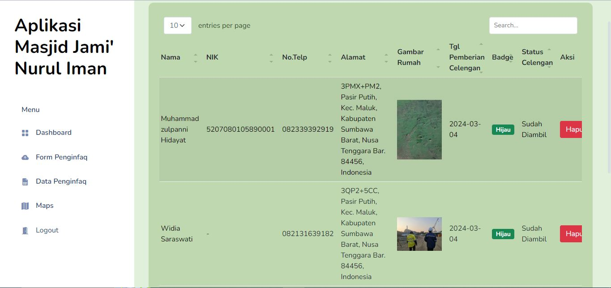
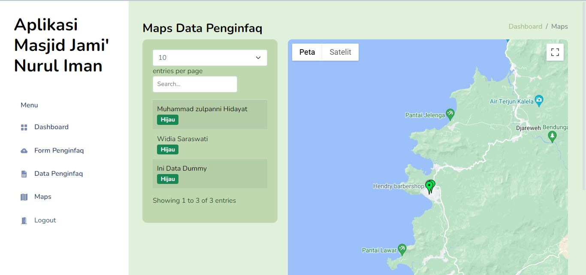

# Infaq Celengan Masjid Jami' Nurul Iman

Website ini merupakan website admin LTS yang digunakan pengurus masjid bersangkutan dengan tujuan untuk mencatat history infaq masjid.

## Tentang Proyek

Proyek ini adalah website untuk Masjid Jami' Nurul Iman Sumbawa. Website ini dikembangkan menggunakan 

  
  
  
  
   untuk memungkinkan pengembangan yang cepat dan responsif.

## Fitur Utama

- Data Penginfaq

- Maps Geolocator

## Instalasi

1. Clone repositori ini ke lokal Anda.
2. Buka terminal dan navigasi ke direktori proyek.
3. Jalankan perintah `php -S localhost:8000` untuk menjalankan server lokal.
4. Buka browser dan kunjungi `http://localhost:8000` untuk melihat website.

## Kontribusi

Jika Anda ingin berkontribusi pada proyek ini, silakan ikuti langkah-langkah di bawah ini:

1. Lakukan fork repositori ini.
2. Buat branch baru dengan fitur yang ingin Anda tambahkan (`git checkout -b fitur-anda`).
3. Lakukan komit perubahan Anda (`git commit -am 'Tambah fitur baru'`).
4. Push ke branch Anda (`git push origin fitur-anda`).
5. Buat permintaan tarik ke repositori ini.
